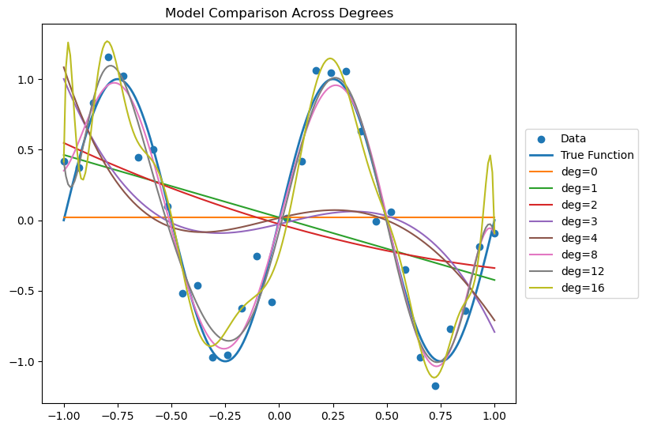
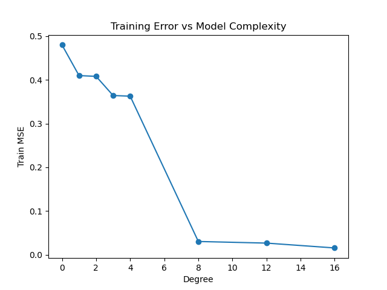

# Experiment 01: Basis Functions & Model Capacity

---

## 1. Objective

To understand how linear models can represent increasingly complex functions through **polynomial basis expansion**, and how model capacity affects fitting behavior.

---

## 2. Theory

We model:

$$
y(x) = \mathbf{w}^T \phi(x)
$$

For polynomial basis of degree ( M ):

$$
\phi(x) = [1, x, x^2, \dots, x^M]
$$

This means:

- The model is **linear in parameters** ( $\mathbf{w}$ )
- But can be **non-linear in input** ( $\mathbf{x}$ )

---

## 3. Method

- Data generated from a non-linear function: ( $\mathbf{\sin(2\pi x)}$ ) with noise
- Same dataset used across all runs
- Polynomial degree varied:

$$
M \in {0, 1, 2, 3, 4, 8, 12, 16}
$$

- Model fitted using **least squares (closed-form)**

---

## 4. Results

### Combined Fit Across Degrees

<figure align="center">
  
  <figcaption><em>Figure 1.1 - Model comparison across degrees.</em></figcaption>
</figure>

### Training Error vs Degree

<figure align="center">
  
  <figcaption><em>Figure 1.1 - Train loss vs model degree.</em></figcaption>
</figure>

---

## 5. Observations

### Order 0 (Constant Model)

- Model predicts a constant value
- Cannot capture any structure in data
- High bias, low variance

---

### Order 1 (Linear Model)

- Learns a straight line ($\mathbf{y = mx + c}$)
- Captures global trend but misses non-linearity

---

### Intermediate Orders

- Able to capture underlying function reasonably well
- Represents a balance between flexibility and stability

---

### High Order

- Model becomes highly flexible
- Fits training data very closely, including noise
- Produces oscillatory behavior between data points

---

### Training Error Behavior

- Training error decreases monotonically with increasing degree
- High-degree models achieve very low training error by fitting noise

---

### Numerical Stability

- As degree increases, the design matrix becomes ill-conditioned
- Leads to unstable solutions and large weight magnitudes ($\mathbf{w}$)

---

## 6. Key Takeaways

- Linear models can represent complex functions via **basis expansion**
- Model capacity is controlled by the choice of **features (φ(x))**
- Increasing capacity reduces training error but leads to **overfitting**
- Overfitting arises because the model can **interpolate noise**
- High-degree polynomial regression introduces **numerical instability**
- Good fit is achieved at an intermediate level of complexity (bias-variance balance)

---

## 7. Conclusion

This experiment demonstrates that increasing model complexity improves training fit but degrades generalization.
